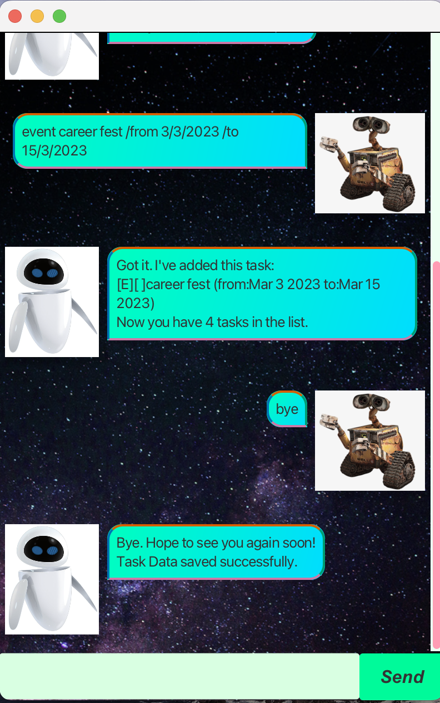
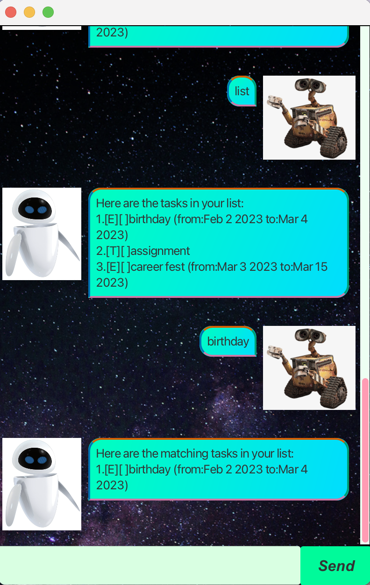

# EVE User Guide



EVE is a **desktop chatbot application for managing your task schedule, optimised for use via a Command Line Interface**(CLI) 
while still having the benefits of a Graphical User Interface(GUI).

You can add tasks, deadlines and events to your schedule, just by telling EVE. You can also tell EVE to mark tasks as done and
remove tasks one by one or multiple at a time.

## Features

**Notes about command format:**

- words in uppercase are to be supplied by the user. E.g. in ```todo TASK```, ```TASK``` is the parameter which can be 
used as ```todo bake cupcakes```.
- input dates are expressed as: ```<dd/mm/yyyy>```. E.g. the date ```02/01/2025```, which is 2 January 2025, follows an acceptable format.
- multiple numerical arguments(that **must** be comma-separated) are denoted as: ```...```. 
E.g. the numerical arguments```1, 2,3``` follow an acceptable format.

## Listing all tasks: ```list```

Shows a list of all the tasks in the list.

Format: ```list```

## Search: ```SEARCH```

Shows a list of all the tasks containing the ```SEARCH``` term. 

Note that:
- search is case-sensitive
- the order of keywords do not matter
- each search result contains at least one of the keywords in the ```SEARCH``` expression

Format: ```SEARCH``` (i.e. just key in the term you are searching for.)

Examples:
- ```baking``` returns ```baking cupcakes``` and ```baking cake```
- ```cupcakes baking``` returns ```baking cupcakes``` and ```baking cake```


## Adding todos: ```todo```

Adds a task without any time restrictions to your task list. 

Format: ```todo TASK```

Examples:
- ```todo bake cupcakes``` adds the task "bake cupcakes" as a todo task.
- ```todo go for a walk``` adds the task "go for a walk" as a todo task.

## Adding deadlines: ```deadline```

Adds a task with a deadline to your task list.

Format: ```deadline TASK /by <dd/mm/yyyy>```
**(Note that while the day and month attributes can be 1 or 2 digits, the year must be 4 digits.)**

Examples:
- ```deadline return book /by 2/3/2025``` adds the task "return book" as a task with the deadline 2 Mar 2025.
- ```deadline maths assignment /by 03/12/2025``` adds the task "maths assignment" as a task with the deadline 3 Dec 2025.

## Adding events: ```event```

Adds an event to your task list.

Format: ```event TASK /by <dd/mm/yyyy>/from <dd/mm/yyyy>```
**(Note that while the day and month attributes can be 1 or 2 digits, the year must be 4 digits.)**

Examples:
- ```event career fair /from 2/3/2025 /to 5/3/2025``` adds the task "career fair" as an event from 2 Mar 2025 to 5 Mar 2025.
- ```event picnic /from 2/3/2025 /to 2/3/2025``` adds the task "picnic" as a single-day event on 2 Mar 2025.

## Marking events: ```mark```

Marks a task as complete.

Format: ```mark ...```
**(Only positive indices are allowed.)**

Examples:
- ```mark 1``` marks the task at index 1 as complete.
- ```mark 2, 3, 4``` marks tasks at indexes 2, 3 and 4 as complete.

## Unmarking events: ```unmark```

Unmarks a task as incomplete.

Format: ```unmark ...```
**(Only positive indices are allowed.)**

Examples:
- ```unmark 1``` unmarks the task at index 1 as complete.
- ```unmark 2, 3, 4``` unmarks tasks at indexes 2, 3 and 4 as complete.

## Deleting events: ```delete```

Removes events from task list.
Format: ```delete ...```
**(Only positive indices are allowed.)**

Examples:
- ```delete 1``` unmarks the task at index 1 as complete.
- ```delete 2, 3, 4``` unmarks tasks at indexes 2, 3 and 4 as complete.

## Clearing completed tasks: ```clean```

Removes all the tasks marked as complete from the list, to clean up the list.

Format: ```clean```

## Saving data: ```bye```

Saves all the data after the command is run. If saved, the data can be retrieved for future use.
**WARNING: Not running this command may cause none of the new data to be saved.**

Format: ```bye```